# Лабораторная работа №6 — Система контроля версий Git

## Цель
Освоить базовые операции системы контроля версий Git и работу с GitHub: создание репозитория и веток, клонирование, фиксация изменений, слияние с разрешением конфликтов, откат коммитов и оформление отчёта в Markdown с иллюстрациями.

---

## Ход работы 

### 1. Создание аккаунта на GitHub
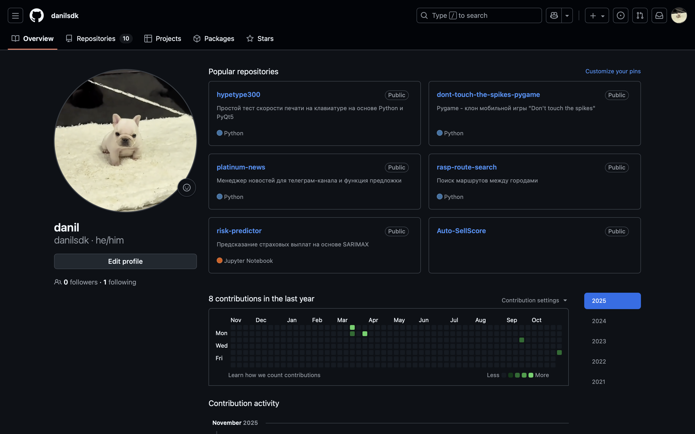

### 2. Форк исходного репозитория
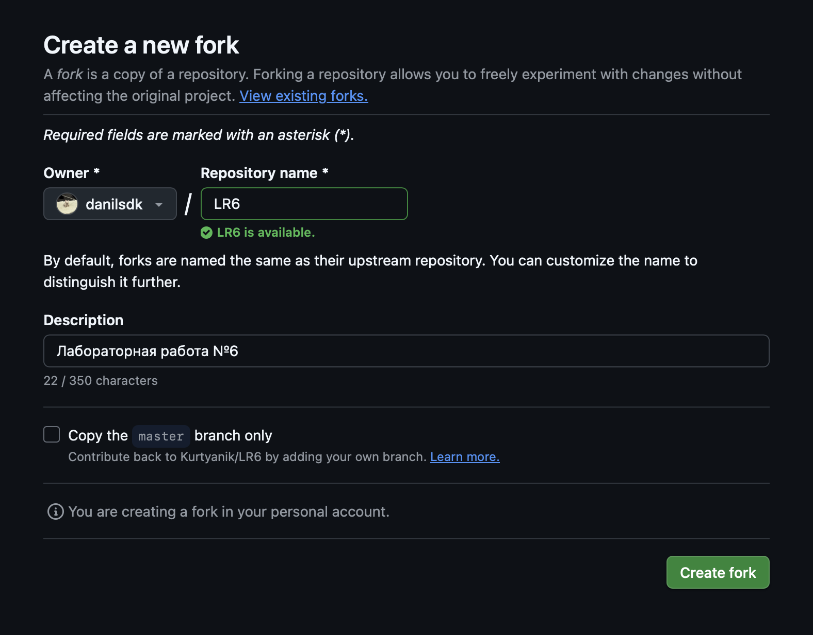

### 3. Первичная настройка Git
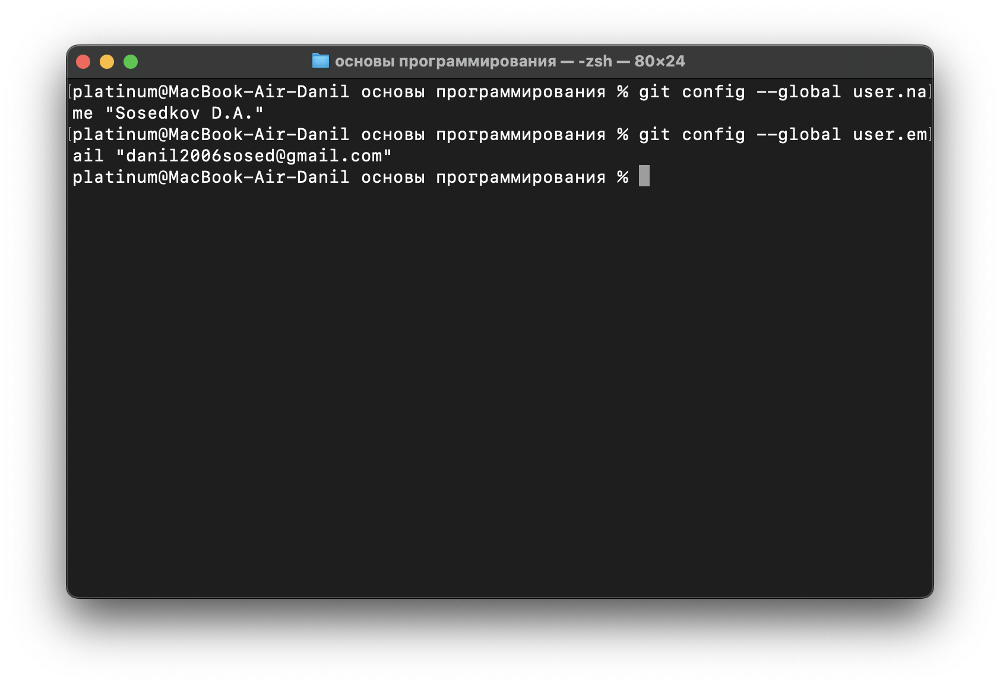

### 4. Клонирование личного репозитория
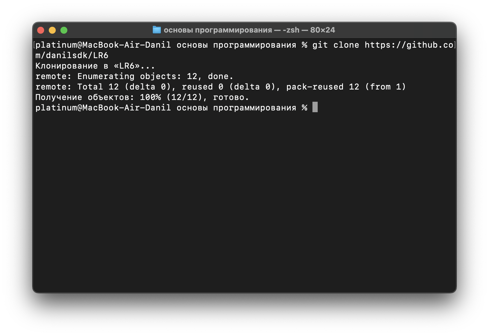

### 5. Добавление файла через веб-интерфейс GitHub 
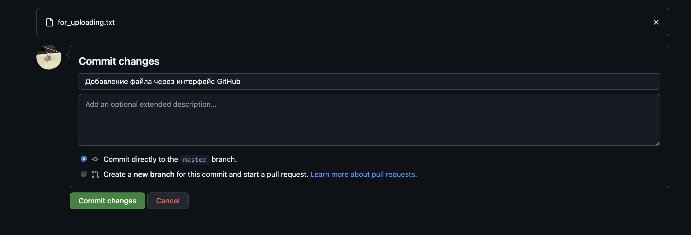

### 6. Подтягивание изменений в локальный репозиторий
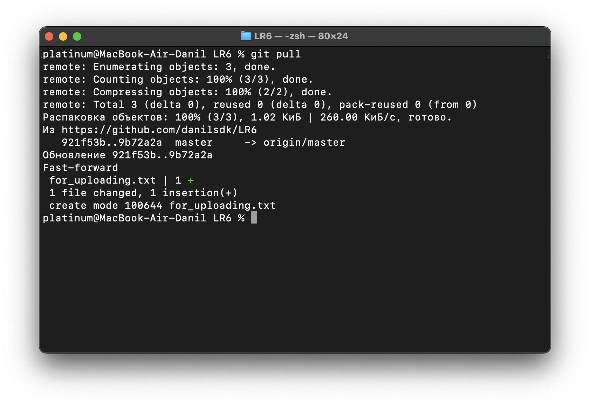

### 7. Просмотр истории в ветке master
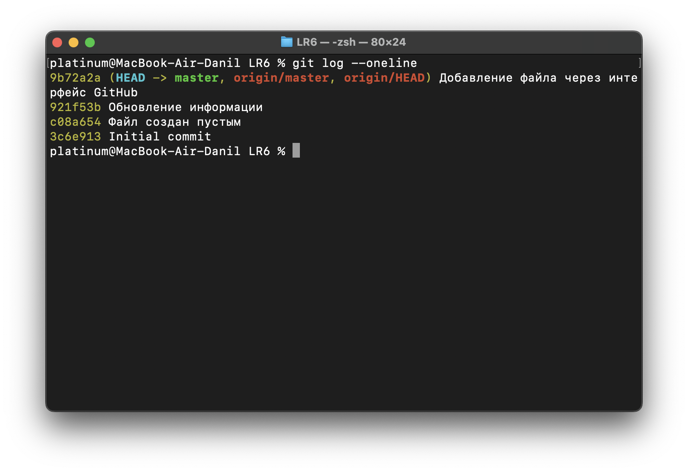

### 8. Просмотр истории в ветке branch1
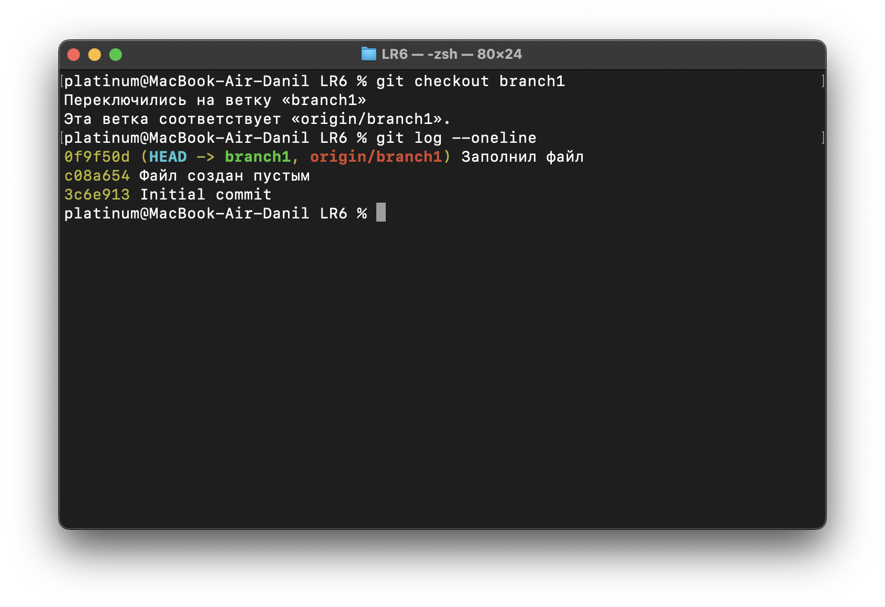

### 9. Просмотр последних изменений (git show) в master
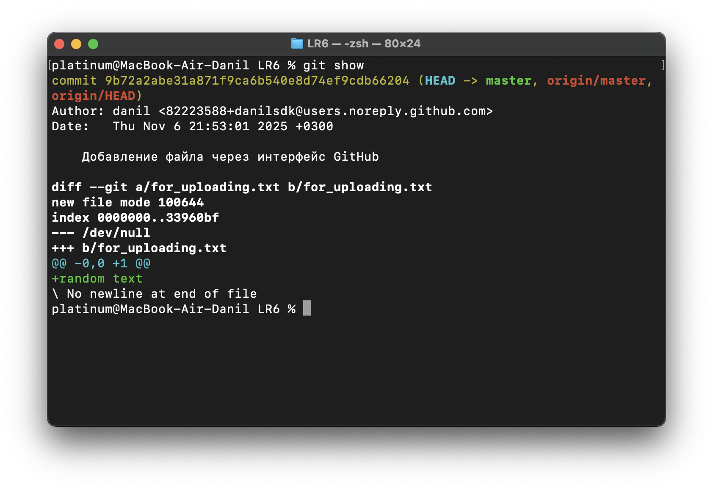

### 10. Просмотр последних изменений (git show) в branch1
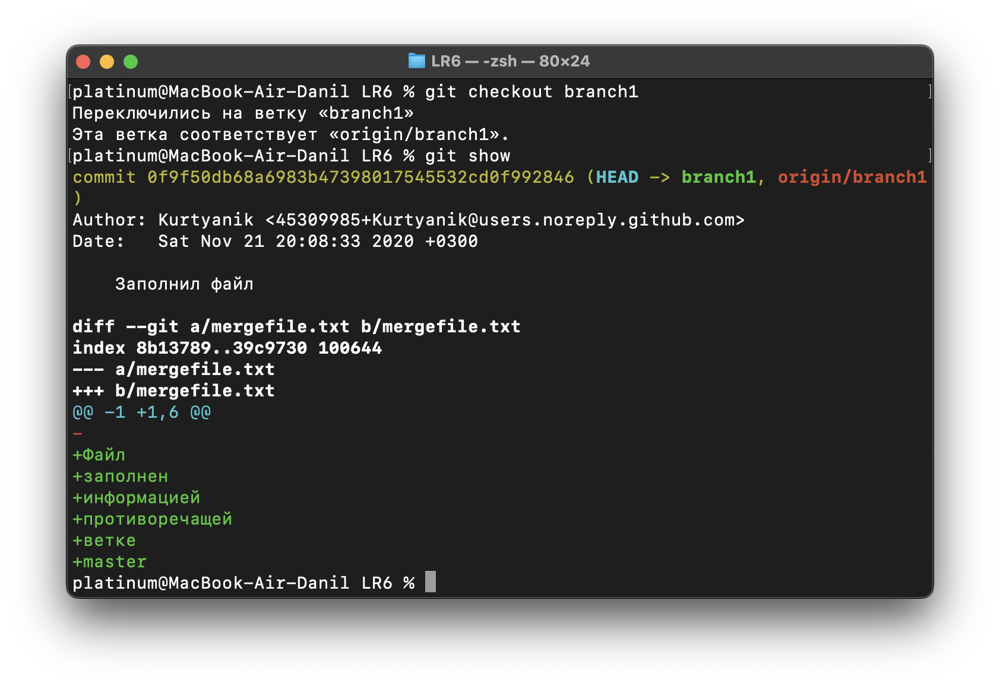

### 11. Слияние веток и возникновение конфликта
При `git merge` получен конфликт слияния.  
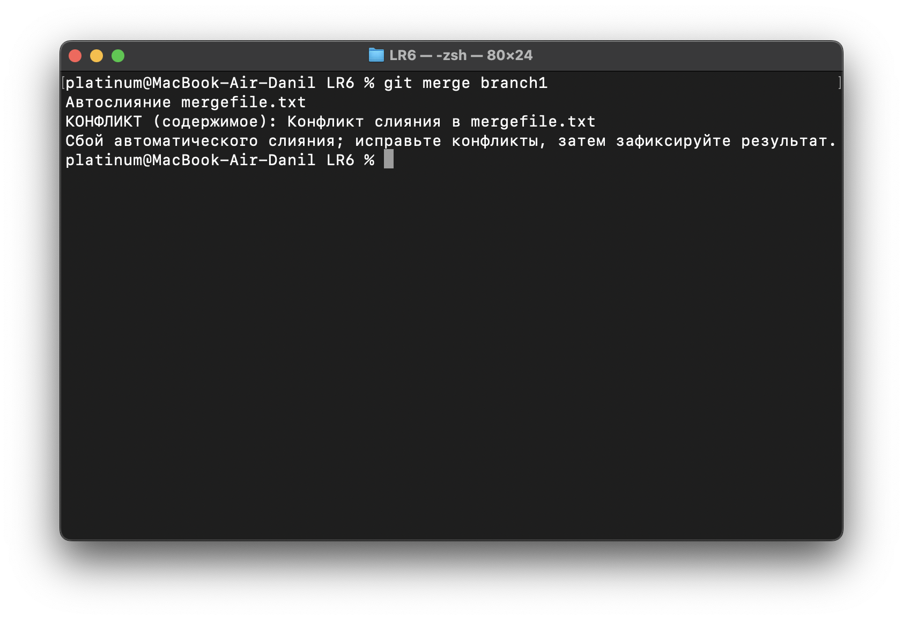

### 12. Разрешение конфликта
Конфликт проанализирован и исправлен изменением текста через текстовый редактор (блокнот); изменения зафиксированы.  
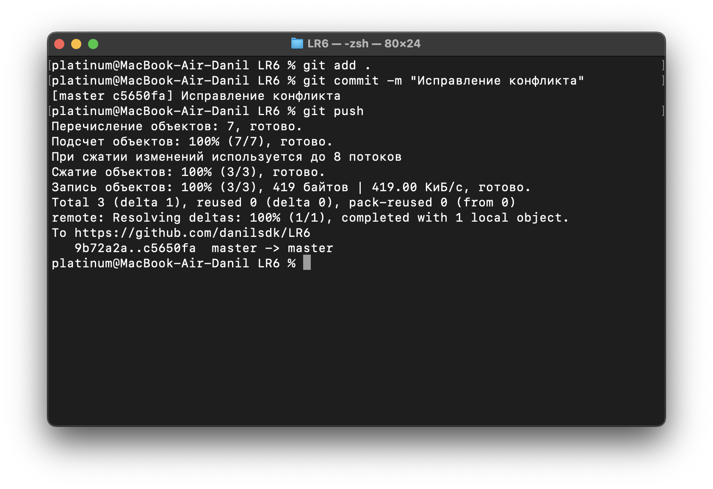

### 13. Удаление лишней ветки после успешного слияния
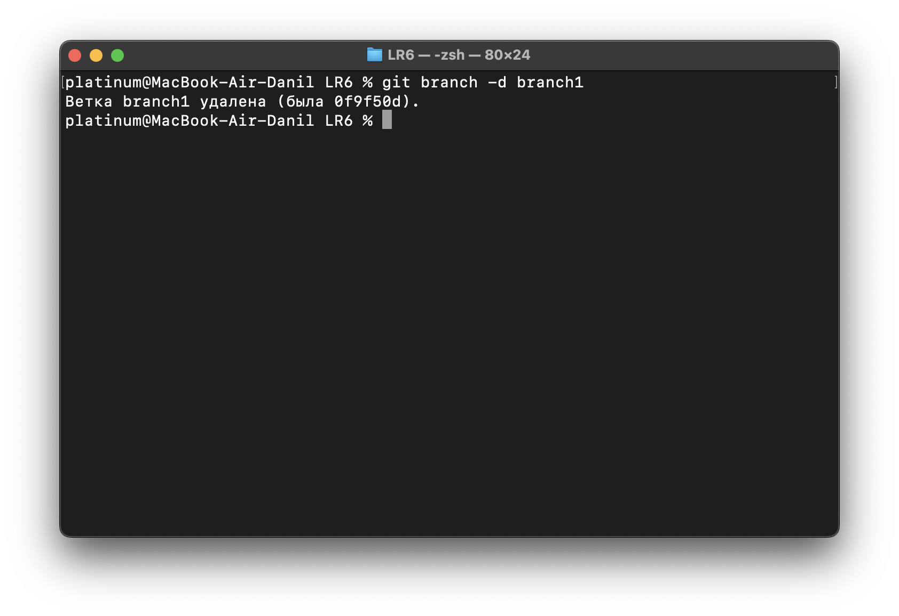

### 14. Подготовка коммита для демонстрации отката
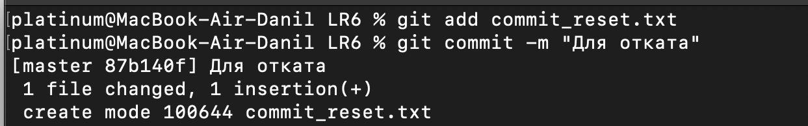

### 15. Откат коммита (git reset)
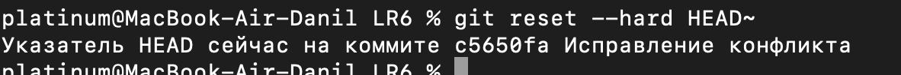

### 16. Создание отдельной ветки для отчёта
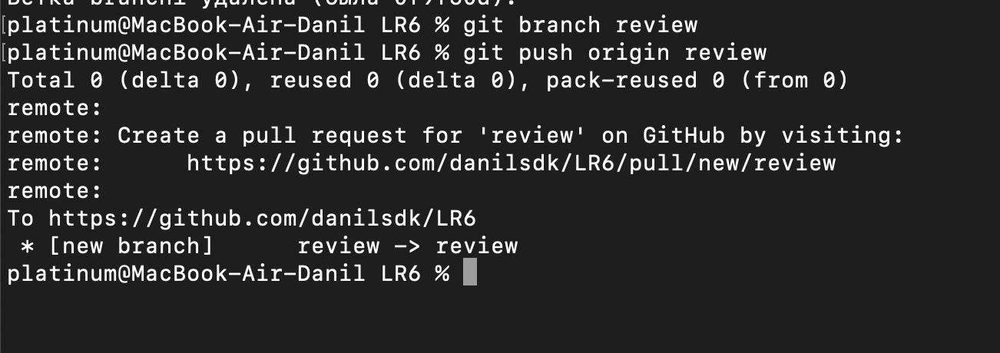

### 17. Организация материалов отчёта
Cкриншоты размещены в папке `img/`
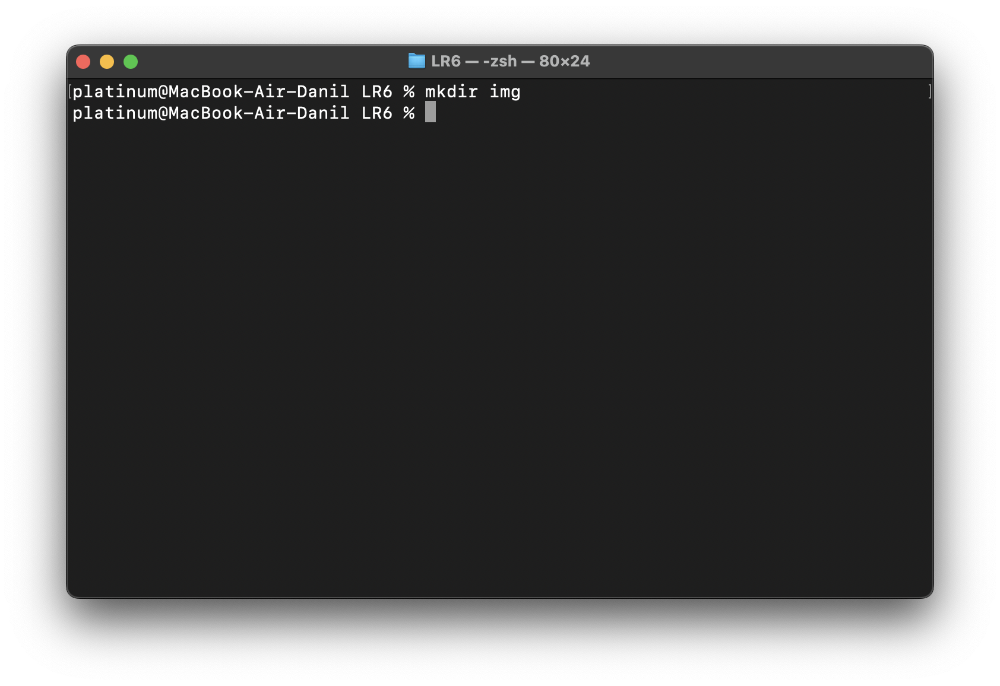

### 18. Создание readme-файла

### 19. Вывод истории операций
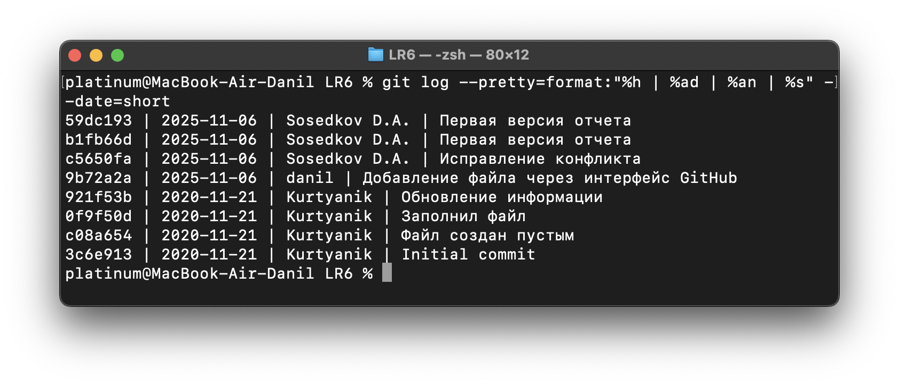

---

## Вывод
Выполнены все требуемые операции: форк и клонирование репозитория, базовая настройка Git, создание и работа с ветками, просмотр истории и изменений, слияние с разрешением конфликта, удаление ветки, подготовка и откат коммита.
